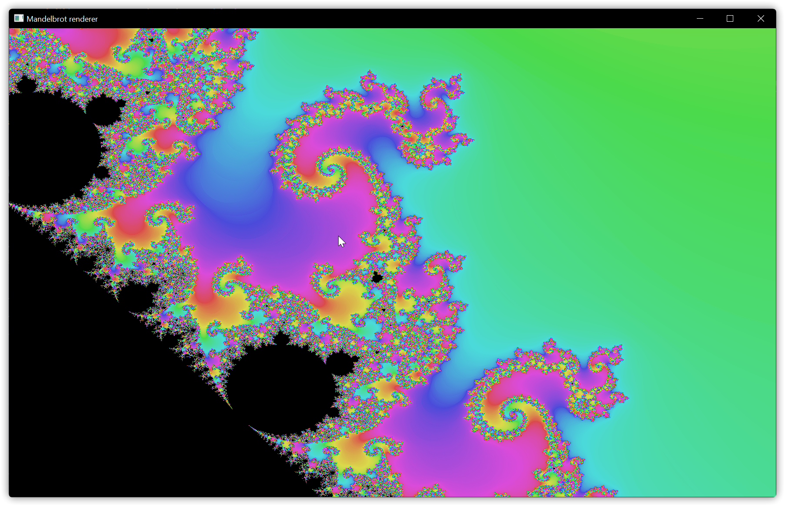

# GPU Mandelbrot renderer

This is a simple Mandelbrot renderer implemented in rust using the [`wgpu`](https://crates.io/crates/wgpu) crate.



## How to run

To run this project simply clone it and do `cargo run`, using the `--release` flag is not necessary as the heavy computations are done on the GPU and therefore not affected by the rust compiler optimizations.

```bash
git clone https://github.com/A-K-O-R-A/gpu_test
cargo run
```

You can move with W/A/S/D, the arrow keys or by dragging with the mouse and sse the mouse wheel to zoom in or out.

### The following Keybindings are available

| Key | Description                   |
| --- | ----------------------------- |
| R   | Reset everything              |
| ,   | decrease Iterations (-100)    |
| .   | increase Iterations (+100)    |
| K   | decrease Radius (-0.1)        |
| L   | increase Radius (+0.1)        |
| O   | decrease coloring Factor (-1) |
| P   | increase coloring Factor (+1) |

## How it works

The rendering pipeline consist of a vertex shader that creates a quad covering the entire screen and a fragment shader that then calculates the correct color for every pixel on the screen.

You can read more about the computation of the mandelbrot set on the [Wikipedia page](https://en.wikipedia.org/wiki/Mandelbrot_set#Computer_drawings) about the mandelbrot set, this project uses a optimized escape time algorithm as described in the wikipedia article "[Plotting algorithms for the Mandelbrot set](https://en.wikipedia.org/wiki/Plotting_algorithms_for_the_Mandelbrot_set#Optimized_escape_time_algorithms)".
